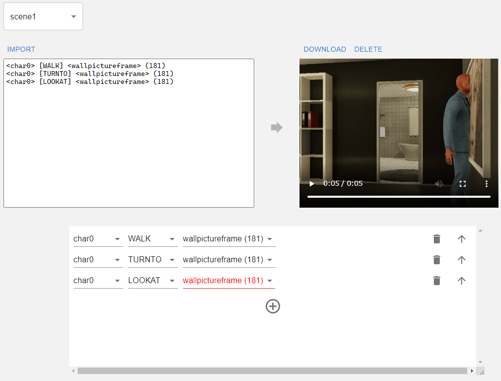

# Prerequisites

- Linux or Mac with Docker and Docker Compose installed.

# Virtualhome script generation system


# How to start

- Clone https://github.com/aistairc/virtualhome2kg_generation.
- directory and branch to kgrc4si.
- Run `git submodule update --init`.
- Download https://github.com/aistairc/virtualhome_unity_aist/releases/download/Build_2023_0111/Build_2023_0111_linux.zip and copy it to `/ virtualhome_aist/docker/unity`.
- Run `docker compose -f full.docker-compose.yml up --build`.
- Wait for a while, and you will see it at http://localhost:8080.

At this time, GraphDB as SPARQL Endpoint and Virtualhome API for video generation will be started locally.  
If you don't need them, you can use the `docker compose up` command.  
Run `docker compose up` to start only the visualization system.  
At that time

```docker-compose.yml
  - version: '3'
  - services:
      - vhecitor:
          - ports:
              - - 3000:3000
          - build:
              - context: ui
              - args:
                  - NEXT_PUBLIC_SPARQL_ENDPOINT: xxx # SPARQL Endpoint接続先URL
                  - NEXT_PUBLIC_API_URL: xxx # virtualhome apiのURL
```

The values of `NEXT_PUBLIC_SPARQL_ENDPOINT` and `NEXT_PUBLIC_API_URL` must be the URLs of the respective connections.  
The script generation system may also deploy to github pages as static pages, provided that each destination meets the following conditions

- Return Access-Control-Allow-Origin as a response header, or the domain where the visualization system resides.
- HTTPS.

# How to update definition files

Definitions for Actions are in `/ui/scripts/actions/actions.csv`.
For object definitions, replace `/ui/scripts/actions/actions.csv` to `scene7.csv` in `/ui/scripts/objects/` and update them again.
CSV files from `scene1.csv` to `scene7.csv` in `/ui/scripts/objects/` and rebuild.

# How to update data

This repository has `kgrc4si` from https://github.com/KnowledgeGraphJapan/KGRC-RDF as a forked source, and when there is a change in RDF data etc. that the branch has, it is possible to synchronize it by the following procedure.

```
git remote add upstream git@github.com:KnowledgeGraphJapan/KGRC-RDF.git # set upstream repository
git fetch upstream # update upstream repository
git merge upstream/kgrc4si # Sync with upstream branch
```

 Virtualhome API system

# How to start

- Clone https://github.com/aistairc/virtualhome_aist.
- Make the branch `docker`.
- Download https://github.com/aistairc/virtualhome_unity_aist/releases/download/Build_2023_0111/Build_2023_0111_linux.zip and place it in `/docker/ unity`.
- Go to `docker`.
- Run `docker compose up --build`.
- Open http://localhost/ and if you see `{"Hello": "VirtualHome"}` on the screen, you are up and running.

The port number is 80. If you want to change it, 

```docker-compose.yml
  - version: "3.8"
  - services:
      - unity:
          - build:
              - context: ./unity
          - image: vh0
          - volumes:
              - - ./Output:/Output # NOTE: Match the host side to the machine you want to run on.
      - api:
          - build:
              - context: ..
              - dockerfile: ./docker/api/Dockerfile
          - image: vh0-api
          - ports:
              - - "80:80"
          - volumes:
              - - ./Output:/Output # NOTE: Match the host side to the machine you want to run on.
          - depends_on:
              - unity:
                  - condition: service_started
          - environment:
              - ALLOW_CORS: 'true'
```

services > api > ports Change the number to the left of what is set.

## Additional information about each service

The following services are included in `full.docker-compose.yml`.

- graphdb
- unity
- api
- nginx
- vheditor

The role of each service is as follows.

- `graphdb` provides a SPARQL Endpoint that stores information about existing activities to retrieve them.
- `unity` provides a virtualhome that interprets scripts and generates videos.
- `api` provides an API to interface between `unity` and the browser.
- `nginx` properly routes requests sent by the browser to localhost to `graphdb`, `api`, and `vheditor`.
- `vheditor` is the front-end itself, hosting the content to be displayed by the browser.

The `docker-compose.yml` assumes that `graphdb` and `unity + api` are externally hosted, in which case you should change `NEXT_PUBLIC_SPARQL_ENDPOINT` and `NEXT_PUBLIC_API_URL` to and rebuild to point the references externally.  
Similarly, if you want to host `graphdb` on your end but virtualhome externally, or vice versa, if you want to start virtualhome on your end but use `graphdb` externally, you can change the `full.docker-compose` to `graphdb You can copy and paste the `unity + api` part from `full.docker-compose`.
